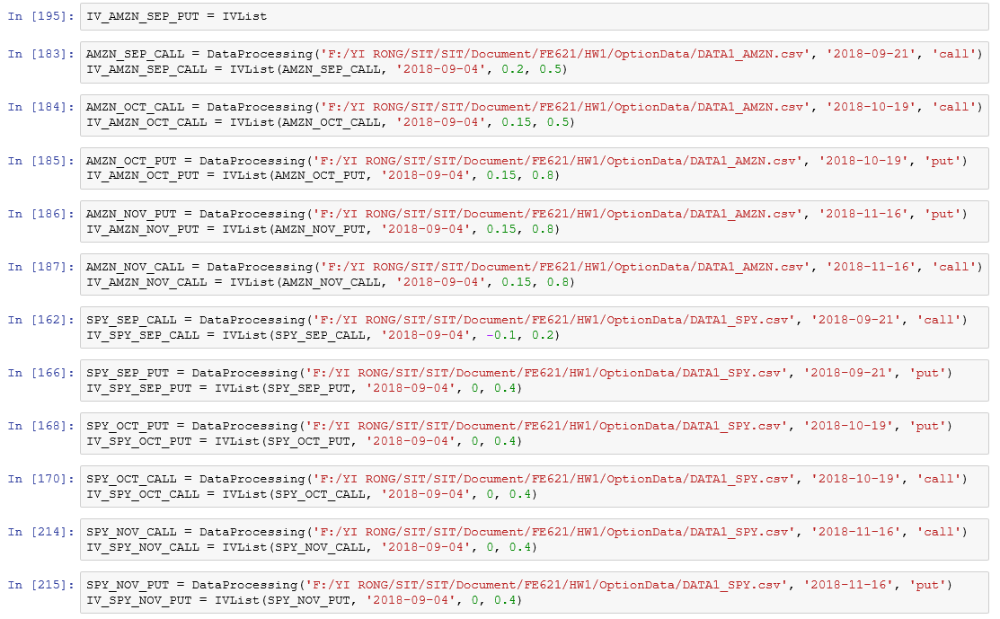

**FE621 HW1**

Name: Yi Rong \| Stevens id: 10425086 \| email: yrong2\@stevens.edu

**Introduction to Tools:**

-   Python 3.5

-   Packages

{width="5.768055555555556in"
height="0.8944444444444445in"}

**Part 1:**

**1&2. Data from Yahoo and Bloomberg**

I downloaded two datasets. But in this assignment, I only use Yahoo
data.

1)  Bloomberg

DATA1 is downloaded at 4:00 PM on 9/5 and DATA2 is downloaded at 4:00 PM
on 9/6. Because it is hard to download all the data simultaneously, only
close prices are obtained here. AMZN call data expired on September is
attached as below:

{width="5.768055555555556in"
height="1.448611111111111in"}

2)  Yahoo Finance

For data retrieval and pre-processing, I created two functions.

The first one is used to download option data of multiple assets and
save them in local.

{width="5.768055555555556in"
height="1.042361111111111in"}

{width="5.768055555555556in" height="0.88125in"}

The second one is used to read data and modify them to a concise format
based on symbol, type and expiration date.

{width="5.768055555555556in"
height="3.6034722222222224in"}

**3. Description**

AMZN is the NASDAQ stock exchange symbol for Amazon. SPY is the
abbreviation for the SPDR S&P 500. It is an exchange-traded fund (ETF)
in NYSE Arca, which is designed to track the S&P 500 stock market index.
VIX, or the Volatility Index, is an index created by the Chicago Board
Options Exchange (CBOE), which shows the market's expectation of 30-day
volatility.

For a monthly expired option, AMZN and SPY are expired the third Friday
on the month, which are 9/21, 10/19, 11/16 and so on. And the expiration
dates for VIX are the third Wednesday on the month, which are 9/19,
10/17, 11/21 and so on.

**4. Underlying Price / Short-term Interest rate / Time to Maturity**

DATA1 is downloaded at 3:28 PM on 9/4 and DATA2 is downloaded at 9:40 AM
on 9/5. The underlying prices and short-term interest rate are shown in
the chart below:

                              DATA1     DATA2
  --------------------------- --------- ---------
  AMZN                        2042.11   2027.46
  SPY                         289.745   289.34
  VIX                         13.29     13.55
  Federal funds (effective)   1.92%     1.92%

The time to maturity is calculated based on year. In this assignment,
there are 365 days in 1 year.

**Part 2:**

**5. BS Formulas**

Two functions below are created for pricing European call and European
put:

{width="5.768055555555556in"
height="1.8930555555555555in"}

**6. Bisection Method**

The function below is created for Bisection Method. In the function, the
tolerance level is set as $10^{- 6}$.

{width="5.768055555555556in"
height="1.6930555555555555in"}

With the pricing functions and Bisection method above, I create a
function to calculate all the implied volatilities based on different
strike prices and bid and ask prices.

{width="5.768055555555556in"
height="3.622916666666667in"}

The implied volatilities for AMZN put expired on 9/21 and the average
value are shown as below:

{width="5.768055555555556in"
height="0.6378357392825896in"}

The average value can be calculated as 0.2566. Then, with this method,
we can compute all the volatility values and their average.**\
**

**7. Implied Volatility Table**

All the volatility values are calculated through the same functions as
above:

{width="5.768055555555556in"
height="3.5708333333333333in"}

It is not necessary to show all the results, so I attach the result for
AMZN with expiration in November and SPY with expiration in October.

{width="5.768055555555556in"
height="4.198611111111111in"}

{width="5.768055555555556in"
height="4.207638888888889in"}

With all the volatility values above, a table for average volatilities
can be obtained as below:

             AMZN     SPY      VIX (%)            
  ---------- -------- -------- --------- -------- ---------
             Call     Put      Call      Put      Current
  9/21/18    0.2455   0.2566   0.1063    0.1449   13.29
  10/19/18   0.2543   0.2687   0.0908    0.1261   13.29
  11/16/18   0.3064   0.3031   0.1048    0.1308   13.29

**Comment:** Compared with SPY, the volatilities for AMZN are much
higher and it makes sense for the current market. As the maturity
increases, AMZN shows a higher volatility, but SPY doesn't change a lot.
From question 9, it is known that when the strike prices go up,
volatility values are decreasing then increasing, like a smile. And this
rule is followed by both put and call.

**\
**

**8. Put-Call Parity**

With Put-Call Parity, I create a function to compute the theoretical
price for an option.

{width="5.768055555555556in"
height="2.982638888888889in"}

Then, I use the function to calculate the theoretical prices. For AMZN,
I calculate the call price for options expired in 9/21. Then, I make a
comparation with real prices. The results are shown:

{width="5.768055555555556in"
height="4.688888888888889in"}

For SPY, I calculate the call price for options expired in 9/21 as well.
Then, I make a comparation with real prices. The results are attached as
below:

{width="5.915729440069991in"
height="3.050561023622047in"}

**Comment:** From the two results, it can be found that the theoretical
prices and real prices are quite close. Hence, the Put-Call Parity can
be used to calculate an option price. However, the theoretical prices
and real prices are not exactly the same and I came up with two reasons.
Firstly, the market is not totally efficient, so there are some
opportunities for arbitrage. Secondly, Yahoo Finance gives data with
delay. So, the times for the two prices don't definitely match.

**9. Implied Volatility versus Strike** $\mathbf{K}$

Because only three maturities are considered here, so I show them all
directly and the option expired in September is the one closest to
maturity. The implied volatility values versus strike for AMZN Call,
AMZN Put and SPY are shown as below:

{width="3.9659722222222222in"
height="2.8930555555555557in"}

{width="3.9659722222222222in"
height="2.8930555555555557in"}

**Comment:**

Firstly, the AMZN volatility values are smaller than SPY volatility
values. And this makes sense for a stock and an ETF.

Secondly, for both AMZN and SPY options expired in September, with the
strike prices increasing, the volatility values decrease then reverse,
like a smile.

Thirdly, at the beginning, as the strike price increases, the AMZN
volatility values drops slowly but SPY volatility values drop faster.

Fourthly, for AMZN, the volatility values are higher with further
maturity. However, for SPY, the rule is followed only by options expired
in October and November. The September-expired options show abnormally
high volatility values.

{width="3.9659722222222222in"
height="2.8930555555555557in"}

{width="3.9659722222222222in"
height="2.8930555555555557in"}

**Comment: Call versus Put**

The first picture shows implied volatility for AMZN Call and the second
one shows those for AMZN Put.

Firstly, for both call and put, the volatility values decrease then
reverse, which is like a smile.

Secondly, the trend of SEP-expired lines is the same, crossing down the
blue line then crossing up.

**10. Greeks**

1)  Delta

> The data applied here is SPY call options expired in September. The
> code and result for two methods are shown as below:

{width="5.768055555555556in"
height="2.546527777777778in"}

{width="5.768055555555556in"
height="3.5243055555555554in"}

**Comment:** From the table, it is known that two lists are almost the
same. Hence, the two methods are equivalent as well.

2)  Vega

> The same data is applied here. The code and result are attached as
> below:

{width="5.768055555555556in"
height="2.428472222222222in"}

{width="5.768055555555556in"
height="3.546527777777778in"}

**Comment:** The two lists are quite close, indicating that the two
methods are equivalent as well.

3)  Gamma

> The same data is used here as well. The code and result are attached:

{width="5.768055555555556in"
height="2.5388888888888888in"}

{width="5.768055555555556in"
height="3.547222222222222in"}

**Comment:** The two lists are quite close, showing that the two methods
are equivalent as well.

**11. DATA2 Calculation**

Calculation is operated on SPY call options expired in September. Sigma
is taken from the average value of SPY call options expired in September
in DATA1, which is 0.1063. The code and result are shown as below:

{width="5.768055555555556in"
height="1.2770833333333333in"}

{width="5.768055555555556in"
height="3.9298611111111112in"}

To observe the difference between theoretical and real prices obviously,
a figure is posted as below:

{width="3.876388888888889in"
height="2.8930555555555557in"}

**Comment:** From the figure, it is known that except for one noisy
point, the two lines are very close. This means the volatility, which is
calculated on the last day, still can be utilized to price an option for
one more day. This is because on the second day, the volatility didn't
change much.

**Part 3:**

**1. Trapezoidal Rule and Simpson's quadrature Rule**

I create 3 functions to define $f(x)$, trapezoidal rule and Simpson's
quadrature rule. The code and result are attached as below:

{width="5.768055555555556in" height="0.71875in"}

{width="5.768055555555556in"
height="1.6590277777777778in"}

{width="5.768055555555556in"
height="1.9590277777777778in"}

**Comment:** The results for both methods are quite close to $\pi$,
which is the theoretical result. Hence, the two methods are useful for
integral.

**2. Parameter** $\mathbf{a}$ **and** $\mathbf{N}$

To study the relation between truncation error and $a$ or $N$, I made
two experiments. In the first one, I fixed $a$ as 1000 and set $N$ as
\[\'10\^3\', \'10\^4\', \'10\^5\', \'10\^6\', \'10\^7\'\]. In the second
one, I fixed $N$ as 10\^7 and set $a$ as \[\'10\^3\', \'10\^4\',
\'10\^5\', \'10\^6\', \'10\^7\'\]. The code and result are posted as
below:

{width="5.768055555555556in"
height="1.336111111111111in"}

{width="5.768055555555556in"
height="1.0555555555555556in"}

**Comment:** For the first result, it can be concluded that for
Simpson's rule, a higher $N$ can decrease the error. But for
Trapezoidal, the error even becomes bigger. Hence, increasing $N$ only
works for Simpson method. In addition, as $N$ rising, the difference
becomes smaller. This means a higher $N$ will narrow down the difference
between two methods.

{width="5.768055555555556in"
height="0.5138888888888888in"}

{width="5.768055555555556in"
height="1.1159722222222221in"}

**Comment:** From the second result, it is obvious that as $a$ rising,
the error is becoming smaller. But the difference doesn't change much,
indicating the two methods are similar based on the errors. Therefore,
to improve the result, we can set $a$ higher.

**3. Convergence**

For Trapezoidal rule, the result is shown as:

{width="5.768055555555556in"
height="1.2256944444444444in"}

For Simpson's rule, the result is shown as:

{width="5.768055555555556in"
height="1.2638888888888888in"}

Comment: It can be found that Trapezoidal rule converges at 382 steps
and Simpson's rule converges at 957 steps. Therefore, Trapezoidal rule
converges faster with less steps.

**4. Integral for** $\mathbf{g(x)}$

I create a function to define $g(x)$:

{width="5.768055555555556in"
height="0.43194444444444446in"}

The code and result for two methods is shown as below:

{width="5.768055555555556in"
height="2.704861111111111in"}

{width="5.768055555555556in"
height="2.951388888888889in"}

**Comment:** The integral results for two methods are quite close, which
should be 1.959. However, the step number in Trapezoidal rule is much
less, which is only 73. Hence, for $g(x)$, Trapezoidal rule is much
better.
